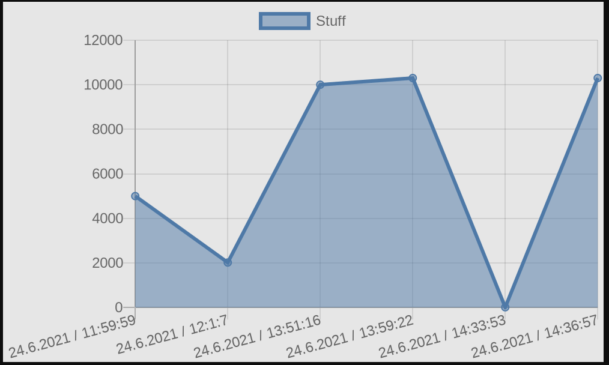
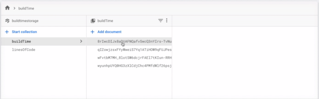

# ValueStorage
A lambda implementation which saves your data you send (e.g. build times, number of dependencies, code coverage, lines of code, ... you name it) to Firebase Firestore.

## How to

### Save data
There is a simple API to store the values:
```
curl \
-X POST \
--header "Authorization: Token [API_KEY]" \
--data "{\"value\": \"[ANY_DATA_YOU_WANT]\"}" \
https://[DeploymentName].vercel.app/api/put/[BUCKET-KEY]
```

For example:
> I want to store the build time in milliseconds

```
curl \
-X POST \
--header "Authorization: Token ABC123" \
--data "{\"value\": \"5002\"}" \
https://valuestorage.vercel.app/api/put/buildTimes
```

### Retrieve values
To get a nice looking chart from all the values you saved you
have to make a simple curl request:
```
curl \
-X POST \
--header "Authorization: Token [API_KEY]" \
https://[DeploymentName].vercel.app/api/get/[BUCKET-KEY]
```

This will return an URL to `quickchart.io`.
You can open this URL to see a nice graph like the following:



### See values
Simply you go to your Firebase project and select Firestore.



## Technical setup

### Firebase
* Create a new Firebase project
* Click on Firestore "Create Database"
* Go to the Project Settings and click `Service accounts`
* Select the "Firebase Admin SDK" section and click on `Create new private key`
* Place and rename the downloaded file at `api/serviceAccount.json`

### Vercel
* Change the currently hardcoded API Token `authorizationToken` in `apicommon/checkToken.go`
* Run `vercel`
